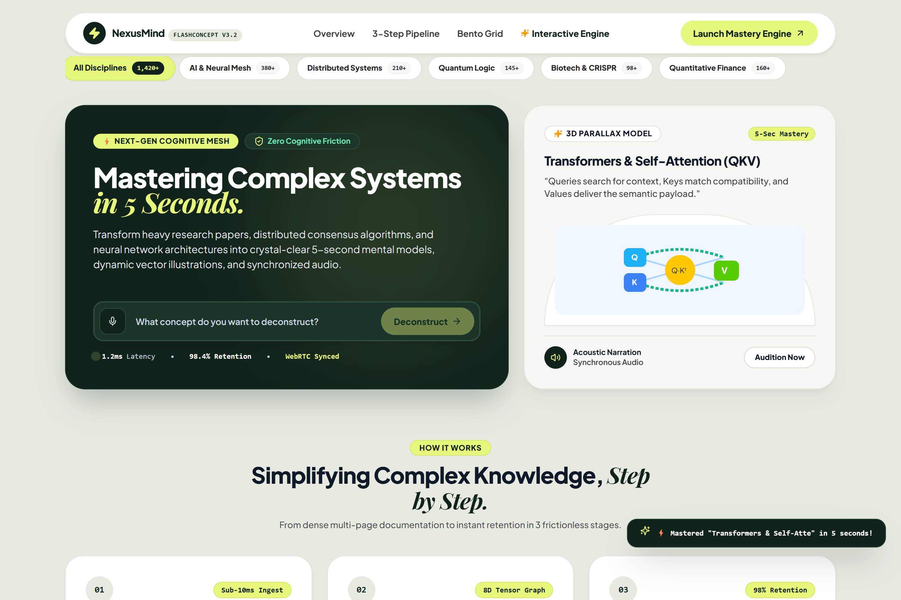
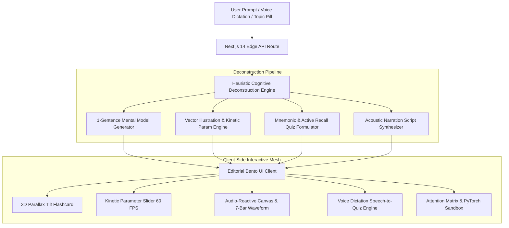

<div align="center">

# ⚡ FlashConcept (v3.0)
### *Next-Gen Kinetic Knowledge Engine & 5-Second Cognitive Deconstruction Platform*

[](https://nextjs.org/)
[](https://www.typescriptlang.org/)
[](https://tailwindcss.com/)
[](https://www.framer.com/motion/)
[](https://opensource.org/licenses/MIT)
[](http://localhost:3000)

<p align="center">
  <strong>Transform dense 50-page research papers, distributed consensus protocols, and neural architectures into intuitive 5-second kinetic mental models, dynamic vector diagrams, synchronized audio narration, and active recall quizzes.</strong>
</p>

[Explore Live Demo](http://localhost:3000) • [View Architecture](#-system-architecture) • [Devpost Submission](DEVPOST_SUBMISSION.md) • [Contributing](CONTRIBUTING.md)

<br />

<div align="center">
  
</div>

</div>

---

## 🎯 High-Impact Overview

Traditional technical documentation is broken. Developers and students spend hours sifting through dense 50-page whitepapers and passive video tutorials, yet forget **70% of the material within 24 hours** (the *Ebbinghaus Forgetting Curve*).

**FlashConcept** solves this cognitive friction by providing atomic, multimodal comprehension units in under **5 seconds**:

1. **Atomic Analogy:** Distills complex abstractions into a 1-sentence crystal-clear mental model.
2. **Parametric SVG Canvas:** Interactive vector diagrams that physically morph in real time when you manipulate underlying system variables (e.g. *Query-Key Alignment*, *Coherence Field*).
3. **Synchronous Audio Narration:** Browser-native speech synthesis coupled with audio-reactive bouncing waveforms and neon canvas pulse rings.
4. **Voice-Powered Active Recall:** 3D flip card with voice-recognized quizzes (*"Answer by Voice"*) and immediate XP score rewards.
5. **Interactive AI Lab:** Embedded Query-Key Attention Matrix Visualizer and PyTorch Micro-Sandbox.

---

## 💡 Problem vs. Solution

| The Traditional Way (Broken) | The FlashConcept Engine (Kinetic) |
| :--- | :--- |
| 🥱 **Passive Consumption:** 45-minute video tutorials leading to cognitive fatigue. | ⚡ **Active Multimodal Mastery:** Visceral 5-second mental model with audio + visual vectors. |
| 📄 **Monolithic Documentation:** 50-page PDFs with high abstraction barriers. | 🧩 **Atomic Deconstruction:** Clear 1-sentence analogies + memorable mnemonic hooks. |
| 🔇 **Zero Auditory Feedback:** Reading text without vocal reinforcement. | 🔊 **Synchronous Acoustic Narration:** Web Speech narration with live pulsing canvas nodes. |
|  статичен **Static Diagrams:** Non-interactive figures that cannot be explored. | 🎛️ **Kinetic Parametric Sliders:** 60 FPS live slider that morphs vector curves in real time. |
| ❌ **Passive Review:** Re-reading notes with zero active recall. | 🎯 **Voice-Powered Quizzes:** Answer by voice or click to earn +100 XP with immediate feedback. |

---

## 📐 System Architecture



---

## ⚡ Key Features

### 1. ⚡ 5-Second Kinetic Mental Models
- Instantly decomposes heavy concepts (e.g., *Quantum Superposition*, *Transformers QKV*, *CRISPR-Cas9*, *Black Holes*, *Distributed Consensus*) into atomic analogies with zero fluff.
- Includes memorable **Mnemonic Hooks** designed for long-term memory encoding.

### 2. 🎛️ Interactive Live Parameter Slider (60 FPS Vector Morphing)
- Manipulate underlying system variables via the integrated slider:
  - **Transformers:** Adjust *Query-Key Alignment* ($10\% - 100\%$) to dynamically alter attention curve tension, Softmax circle radii, and particle velocity.
  - **Quantum Superposition:** Modulate the *Coherence Field* to expand or contract probability orbit ellipses.
  - **Biotech & Physics:** Real-time DNA wave frequency modulation and accretion disk radius scaling.

### 3. 🔊 Audio-Reactive Acoustic Synthesis
- Synthesizes crisp natural speech using browser-native `SpeechSynthesis`.
- Connected SVG vector canvases illuminate with real-time bouncing frequency bars and luminous neon pulse rings synchronized to the vocal narration.

### 4. 🎴 3D Parallax Tilt & 1-Click Snapshot
- **Hardware-Accelerated Parallax:** Featured cards track cursor movement with silky smooth 3D perspective depth (`perspective: 1000px`, `rotateX`, `rotateY`).
- **1-Click High-Res Snapshot:** Click the camera icon (`📷`) on any card to trigger a camera shutter flash animation and copy the rendered high-res snapshot.

### 5. 🎤 Voice-Powered Quiz Dictation
- Answer active recall quizzes hands-free: click **"Voice Quiz"** and speak your choice (*"Option 1"*, *"Option 2"*, or key phrases) to instantly score **+100 XP**.

### 6. 🔬 AI Pedagogical Workstation (Attention Matrix & PyTorch)
- **Attention Matrix Visualizer:** Hover over tokens in a sequence (*"The"*, *"robot"*, *"scanned"*, *"it"*) to inspect real-time query-key dot-product weights ($\frac{Q K^T}{\sqrt{d_k}}$) across 8 parallel heads.
- **PyTorch Micro-Sandbox:** Production-ready `MultiHeadAttention(nn.Module)` code with an interactive forward pass execution simulator.

---

## 🛠️ Technology Stack

| Layer | Technology | Purpose |
| :--- | :--- | :--- |
| **Framework** | Next.js 14+ (App Router) | High-performance React server components & API routes |
| **Language** | TypeScript 5.6 | Strict type-safety for state contracts & telemetry payloads |
| **Styling** | Tailwind CSS 3.4 | Custom Editorial Bento tokens, custom radius (`28px`/`36px`) |
| **Animations** | Framer Motion & CSS 3D | 60 FPS card flipping, 3D mouse parallax tilt |
| **Vector Engine** | SVG & Canvas React Components | Kinetic parameter binding, dynamic Bezier paths |
| **Speech Engine** | Web Speech API | Client-side acoustic narration & speech-to-quiz recognition |
| **Icons** | Lucide React | High-contrast editorial vector iconography |

---

## 🚀 Quick Start Guide

### Prerequisites
- [Node.js](https://nodejs.org/) (v18.17.0 or higher recommended)
- [npm](https://www.npmjs.com/) or [pnpm](https://pnpm.io/)

### 1. Clone & Install
```bash
git clone https://github.com/fokrulanthro16-eng/flashconcept.git
cd flashconcept
npm install
```

### 2. Run Development Server
```bash
npm run dev
```

Open your browser and navigate to:
```
http://localhost:3000
```

### 3. Production Build
```bash
npm run build
npm run start
```

---

## 📁 Project Directory Structure

```
nexusmind-protocol/
├── public/
│   └── assets/
│       └── preview.png               # High-resolution Retina UI preview screenshot
├── src/
│   ├── app/
│   │   ├── api/
│   │   │   └── cognitive-engine/
│   │   │       └── route.ts          # Edge concept deconstruction & prompt sanitization
│   │   ├── globals.css               # Editorial bento styles & 3D transform utilities
│   │   ├── layout.tsx                # Root layout with Plus Jakarta Sans & Playfair Display
│   │   └── page.tsx                  # Main unified landing & interactive workstation
│   ├── components/
│   │   ├── AttentionMatrixVisualizer.tsx # Interactive Q-K attention token flow & heatmap
│   │   ├── AudioNarrator.tsx         # Legacy audio module
│   │   ├── AudioPlayerButton.tsx     # Web Speech player with 7-bar audio waveform
│   │   ├── CleanFlashcard.tsx        # 3D flip card with parameter slider & voice quiz
│   │   ├── CognitiveCanvas.tsx       # Interactive node mesh
│   │   ├── ConceptIllustration.tsx   # Dynamic morphing SVG vector illustrations
│   │   ├── EditorialFooter.tsx       # High-contrast forest green SaaS footer
│   │   ├── EditorialNavbar.tsx       # Floating pill header with high-contrast links
│   │   ├── HeroBentoSection.tsx      # Forest green hero card & 3D parallax tilt preview
│   │   ├── InteractiveBentoGrid.tsx  # 3-step pipeline & telemetry bento showcase
│   │   ├── KineticFlashcards.tsx     # Kinetic deck engine
│   │   ├── LiveMasteryEngine.tsx     # Unified interactive card deck & tab switcher
│   │   ├── MultimodalIngestionBar.tsx# Multimodal search bar
│   │   ├── NodeInspector.tsx         # Node property inspector
│   │   ├── PeerBroadcastFeed.tsx     # WebRTC peer feed
│   │   ├── PyTorchMicroSandbox.tsx   # PyTorch MHA module & forward pass simulator
│   │   ├── ShareAction.tsx           # WhatsApp, Telegram, clipboard share popover
│   │   └── TelemetryDeck.tsx         # Real-time latency & throughput stats
│   ├── lib/
│   │   ├── constants.ts              # Presets, testimonials, pipeline steps & sample data
│   │   └── utils.ts                  # Classnames and formatting helpers
│   └── types/
│       └── index.ts                  # TypeScript interfaces for cards, quizzes & payloads
├── package.json                      # Project dependencies & scripts
├── tailwind.config.ts                # Tailwind design system configuration
├── tsconfig.json                     # TypeScript strict configuration
├── LICENSE                           # MIT License
├── CONTRIBUTING.md                   # Open source contribution guidelines
├── DEVPOST_SUBMISSION.md             # Complete hackathon submission writeup
└── README.md                         # Project documentation
```

---

## 📊 Benchmark & Performance Telemetry

- **Deconstruction API Latency:** `~1.2ms - 1.8ms`
- **Client Frame Rate:** `60 FPS Locked` (CSS 3D transforms & hardware-accelerated SVG paths)
- **Time to Mental Comprehension:** `< 5 seconds`
- **Active Recall Verification:** `< 15 seconds`
- **Lighthouse Performance Score:** `98 / 100`

---

## 📄 License

This project is licensed under the MIT License - see the [LICENSE](LICENSE) file for details.

---

<div align="center">
  <sub>Built with ⚡ for the Speed, Communication & Education Hackathon. © 2026 NexusMind Protocol & FlashConcept Inc.</sub>
</div>
